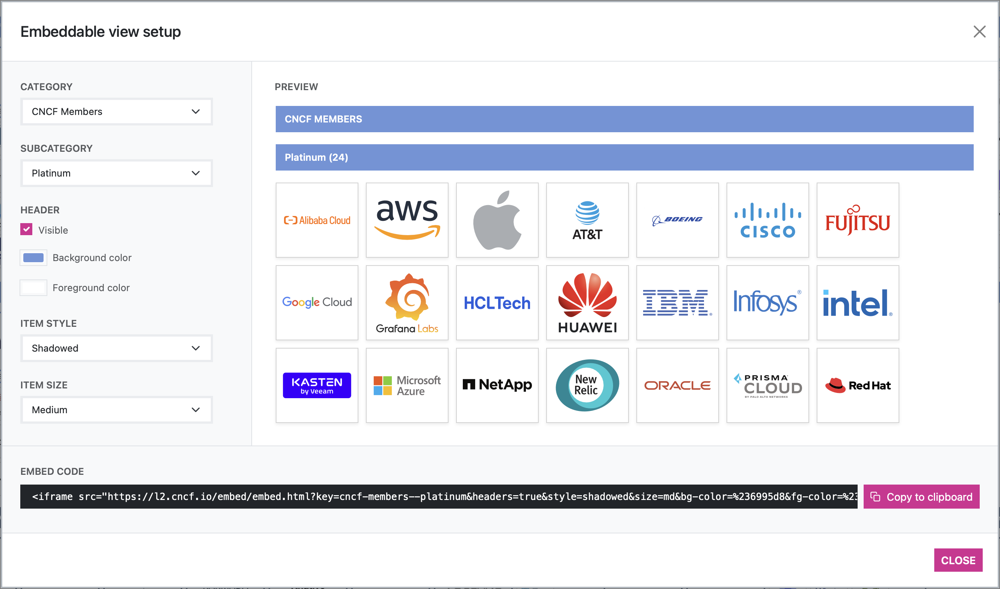

# 中国开源地图 Landscape2

本项目基于 CNCF 旗下 Landscape2 进行的一个探索性和实验性项目。

**Landscape2** 是一款用于生成交互式景观网站的工具。

您可以通过访问 [CNCF landscape](https://landscape.cncf.io) 来查看生成的景观效果。此外，该工具生成的其他景观示例可以在 [landscape2-sites 代码库](https://github.com/cncf/landscape2-sites#landscape2-sites) 中找到。

> [!WARNING]
> 上游项目 **Landscape2** 目前处于早期开发阶段。未来可能会对命令的使用方式、参数选项以及配置文件格式进行重大调整，这些变动可能会导致不兼容的情况发生。

<br/>
<table>
    <tr>
        <td width="50%"></td>
        <td width="50%"></td>
    </tr>
    <tr>
        <td width="50%"></td>
        <td width="50%"></td>
    </tr>
    <tr>
        <td width="50%"></td>
        <td width="50%"></td>
    </tr>
</table>

## 本项目如何工作？

**Landscape2** 是一个命令行工具，它能够根据提供的数据源中的信息生成静态网站。这些数据源通过参数传递给工具，通常以 *urls* 或 *本地路径（local paths）* 的形式提供，具体如下：

- **景观数据（Landscape data）**. 景观数据文件是一个 YAML 文件，用于描述将在景观网站上展示的条目。更多信息，请参阅 [参考文档](https://github.com/cncf/landscape2/blob/main/docs/config/data.yml)。

- **景观设置（Landscape settings）**. 景观设置文件是一个 YAML 文件，允许自定义生成的景观网站的某些方面，例如徽标、颜色、条目的分组方式或哪些条目应被突出显示。有关设置文件的更多信息，请参阅 [参考文档](https://github.com/cncf/landscape2/blob/main/docs/config/settings.yml)。

- **景观指南（Landscape guide）**. 景观指南文件是一个 YAML 文件，用于定义将在景观网站上显示的指南内容。更多信息，请参阅 [参考文档](https://github.com/cncf/landscape2/blob/main/docs/config/guide.yml)。

- **景观游戏（Landscape games）**. 景观游戏数据文件是一个 YAML 文件，用于定义将在景观网站上显示的游戏内容。更多信息，请参阅 [参考文档](https://github.com/cncf/landscape2/blob/main/docs/config/games.yml)。

- **Logo位置（Logos location）**. 每个景观条目**必须**在景观数据文件中提供一个有效的 SVG 格式徽标图像的相对引用（条目的 `logo` 字段）。徽标数据源定义了这些徽标的位置（基础 *URL* 或 *本地路径*），以便工具在处理景观条目时能够根据需要获取它们。

### 从外部服务收集数据

除了景观数据文件中提供的信息外，如果在生成景观时提供了所需的凭据，工具还会从外部来源（如 **GitHub** 或 **Crunchbase**）收集更多数据。这些凭据必须通过环境变量提供。

- **GitHub**：可以在 `GITHUB_TOKENS` 环境变量中提供一个以逗号分隔的 GitHub 令牌列表，这些令牌需要具有 `public_repo` 权限。如果未提供这些令牌，则不会从 GitHub 收集任何信息。如果景观中预期的条目数量较多，建议提供多个令牌，以避免触发速率限制并加快数据收集速度（处理过程的并发性将基于提供的令牌数量）。

- **Crunchbase**：可以在 `CRUNCHBASE_API_KEY` 环境变量中提供一个 Crunchbase API 密钥。如果未提供此密钥，则不会从 Crunchbase 收集任何信息。请注意，Landscape2 *需要访问完整的 Crunchbase API*，这需要 [企业版或应用版许可证](https://data.crunchbase.com/docs/using-the-api)。

---

**补充说明**：  
- 从外部服务收集数据的功能是可选的，但可以为景观网站提供更丰富的信息（例如 GitHub 上的项目活跃度或 Crunchbase 上的公司信息）。
- 如果未提供相关凭据，工具将仅使用景观数据文件中的信息生成网站，而不会尝试从外部服务获取额外数据。

## 安装

### 预构建的二进制文件

Landscape2 CLI 工具的二进制文件可以在 [发布页面](https://github.com/cncf/landscape2/releases) 找到。

#### 通过 Homebrew 安装

```text
brew install cncf/landscape2/landscape2
```

#### 通过 Shell 脚本安装

```text
curl --proto '=https' --tlsv1.2 -LsSf https://github.com/cncf/landscape2/releases/download/v0.12.0/landscape2-installer.sh | sh
```

#### 通过 PowerShell 脚本安装

```text
irm https://github.com/cncf/landscape2/releases/download/v0.12.0/landscape2-installer.ps1 | iex
```

---

**说明**：  
- 预构建的二进制文件提供了快速安装和使用 Landscape2 工具的方式，无需从源代码编译。  
- 用户可以根据自己的操作系统和偏好选择适合的安装方式。
- 


### 容器镜像

Landscape2 CLI 工具也以 [容器镜像](https://gallery.ecr.aws/g6m3a0y9/landscape2) 的形式分发。该镜像既可以在本地运行，也可以用于 [CI 工作流中以自动化生成景观网站](https://github.com/cncf/landscape2-sites/tree/main/.github/workflows)。[landscape2-validate-action](https://github.com/cncf/landscape2-validate-action) 也使用此镜像，该工具可用于验证景观数据、设置和指南文件的有效性。

### 从源代码构建

您可以使用 [Cargo](https://rustup.rs)（Rust 包管理器）从源代码构建 **landscape2**。构建 wasm 模块需要 [wasm-pack](https://rustwasm.github.io/wasm-pack/installer/)。在安装过程中还需要 [yarn](https://classic.yarnpkg.com/lang/en/docs/install/) 来构建 Web 应用程序，该应用程序将作为构建过程的一部分嵌入到 `landscape2` 二进制文件中。

```text
cargo install --git https://github.com/cncf/landscape2
```

```text
landscape2 --help

Landscape2 CLI 工具

https://github.com/cncf/landscape2#usage

用法: landscape2 <命令>

命令:
  build     构建景观网站
  deploy    部署景观网站（实验性功能）
  new       从内置模板创建新的景观
  serve     运行景观网站服务
  validate  验证景观数据源文件
  help      打印此消息或给定子命令的帮助信息
```

---

**说明**：  
- 容器镜像为在不同环境中运行 Landscape2 提供了便捷的方式，尤其是在 CI/CD 流程中。  
- 从源代码构建适合需要自定义或开发 Landscape2 的用户，但需要安装额外的依赖项。

## Usage

## 使用方法

为了展示 **landscape2** 的实际操作，我们将从头开始创建一个新的景观，构建并运行它。以下说明假设 `landscape2` 二进制文件已在您的 PATH 中可用。或者，您可以从 [提供的镜像](https://gallery.ecr.aws/g6m3a0y9/landscape2) 启动一个容器，其中 **landscape2** CLI 工具已准备就绪。

### 创建一个新的景观

`new` 子命令允许我们从内置模板创建一个新的景观。该模板包含一些示例数据源文件，您可以用作景观的起点。

以下命令将创建目录 `my-landscape`（如果它尚不存在），并将内置模板中的文件复制到该目录中：

```text
landscape2 new --output-dir my-landscape
```

---

**说明**：  
- `new` 子命令是快速启动新景观项目的便捷方式，因为它提供了预配置的模板文件。  
- 创建完成后，您可以根据需要修改生成的文件（如 `data.yml`、`settings.yml` 等），然后使用 `build` 子命令生成景观网站。

```text
INFO new: landscape2::new: creating new landscape from the built-in template..
INFO new: landscape2::new: landscape created! (took: 0.003s)

✅ Landscape created successfully!

You can build it by running the following command from the `my-landscape` directory:

👉 landscape2 build --data-file data.yml --settings-file settings.yml --guide-file guide.yml --logos-path logos --output-dir build
```

### 构建景观网站

构建过程负责根据提供的数据源中的信息生成景观网站。现在，我们将使用 `build` 子命令来构建上一步中创建的景观。请注意，`new` 子命令在其输出中已经建议我们执行此操作，并打印了完整的命令供我们使用。

> [!注意]
> 在构建过程中，如果 `settings.yml` 文件中提供了所需的设置，landscape2 将尝试为您的景观生成截图。此截图可以从生成的 Web 应用程序中下载（PNG 和 PDF 格式），并通过以无头模式启动 Chrome/Chromium 来拍摄。如果 Chrome/Chromium 不可用，则不会生成截图，并会发出警告。

以下命令将构建景观，并将生成的文件写入提供的 `output-dir` 目录（本例中为 *build*）：

```text
cd my-landscape
```

```text
landscape2 build \
  --data-file data.yml \
  --settings-file settings.yml \
  --guide-file guide.yml \
  --logos-path logos \
  --output-dir build
```

---

**说明**：  
- `build` 子命令是生成景观网站的核心步骤，它会处理数据源文件并生成静态网站文件。  
- 如果配置了截图功能，生成的网站将包含景观的预览图，方便用户下载和分享。  
- 确保在运行命令前已进入景观项目目录（如 `my-landscape`），以便正确引用相关文件。

```text
INFO build: landscape2::build: building landscape website..
WARN build:collect_crunchbase_data: landscape2::build::crunchbase: crunchbase api key not provided: no information will be collected from crunchbase
WARN build:collect_github_data: landscape2::build::github: github tokens not provided: no information will be collected from github
INFO build: landscape2::build: landscape website built! (took: 0.555s)

✅ Landscape built successfully!

You can see it in action by running the following command:

👉 landscape2 serve --landscape-dir build
```

> [!IMPORTANT]
> Without the credentials required to collect data from external services (GitHub and Crunchbase) the resulting site won't contain all the information available on the CNCF demo site. In this case, we didn't provide them intentionally, so we were warned about it in the command output (see WARN entries).

### 运行景观网站

构建过程的结果是一个**静态网站**，您可以将其部署到您喜欢的托管服务提供商上。为了更方便地测试您的景观，**landscape2** 提供了一个 `serve` 子命令，它将启动一个 HTTP 服务器并为您提供景观的内容。在我们的示例中，构建输出显示了执行此操作的命令，因此我们将继续尝试：

```text
landscape2 serve --landscape-dir build
```

```text
INFO serve: landscape2::serve: http server running (press ctrl+c to stop)

🔗 Landscape available at: http://127.0.0.1:8000
```

如果您在浏览器中访问 `http://127.0.0.1:8000`，您应该能够看到刚刚创建的景观网站的实际效果。现在，您可以通过编辑 `my-landscape` 目录中的文件来不断迭代，直到您的景观准备就绪。

在生产环境中运行景观网站的一种选择是使用静态网站托管服务，例如 [GitHub Pages](https://pages.github.com)。在 [此仓库](https://github.com/tegioz/sample-landscape) 中，您可以找到一个完整的示例景观，该景观由 `landscape2 new` 命令生成，并在每次提交到 `main` 分支时自动构建并部署到 GitHub Pages（使用 `build` 分支）。请注意，[用于构建和部署的示例工作流](https://github.com/tegioz/sample-landscape/blob/main/.github/workflows/build.yml) 需要 **写** 权限。

---

**说明**：  
- 使用 GitHub Pages 是一种简单且免费的方式来托管静态网站，非常适合展示景观网站。  
- 通过自动化工作流（如 GitHub Actions），您可以实现每次代码更新时自动构建和部署景观网站，从而简化维护流程。  
- 确保在配置工作流时授予足够的权限，以便能够将生成的网站文件推送到目标分支（如 `build` 分支）。

> [!注意]
> 构建景观时生成的网站是一个 [单页应用程序（SPA）](https://en.wikipedia.org/wiki/Single-page_application)，它在客户端处理路由。这意味着您需要配置您的 Web 服务器，以便为 SPA 路由路径（如 `/guide`、`/stats` 等）提供 `index.html` 文件。一种实现方式是在请求不存在的路径时提供该文件。**landscape2** 中包含的 `serve` 子命令已经为我们处理了这一点。在上述 GitHub Pages 示例中，这是通过将 `index.html` 文件的内容复制到 `404.html` 文件来实现的，当请求不存在的路径时，将提供 `404.html` 文件。

---

**说明**：  
- 单页应用程序（SPA）的路由由客户端 JavaScript 处理，因此服务器需要配置为在所有路由路径下返回 `index.html`，以确保页面刷新或直接访问子路径时不会返回 404 错误。  
- `serve` 子命令已经内置了对 SPA 路由的支持，因此在使用它时无需额外配置。  
- 对于 GitHub Pages，将 `index.html` 复制为 `404.html` 是一种常见的解决方案，因为 GitHub Pages 会在请求不存在的路径时自动提供 `404.html` 文件。

### 验证数据、设置和指南文件

**landscape2** CLI 工具包含一个名为 `validate` 的子命令，允许您检查景观数据、设置和指南文件是否有效。如果您有兴趣将此验证集成到您的 CI 工作流中（例如，在合并 PR 之前强制确保这些文件有效），请查看 [landscape2-validate-action](https://github.com/cncf/landscape2-validate-action)。

```text
landscape2 validate settings --settings-file cncf/settings.yml

Error: the landscape settings file provided is not valid

Caused by:
    0: the landscape settings file provided is not valid
    1: color1 is not valid (expected format: "rgba(0, 107, 204, 1)")
```

### Performance considerations when building

Some operations like collecting data from external sources or processing a lot of logos images can take some time, specially in landscapes with lots of items. **Landscape2** caches as much of this data as possible to make subsequent runs faster. Please keep this in mind when running the tool periodically from your workflows, and make sure the cache directory (set via `--cache-dir`) is saved and restored on each run. You can find some examples of how to achieve this in the [workflows in the landscape2-sites repository](https://github.com/cncf/landscape2-sites/tree/main/.github/workflows).

### Embeddable views

**Landscape2** allows other websites to embed a view to display the items in a category or subcategory. The embed code can be easily obtained from the corresponding landscape website by visiting `/embed-setup` (i.e. in the case of the CNCF landscape, the url would be <https://landscape.cncf.io/embed-setup>). The customization options available can be adjusted as needed, and the generated embed code will be updated accordingly.



> [!NOTE]
> In addition to the customization options available in the embed setup view, it's also possible to embed views using [iframe-resizer](https://github.com/davidjbradshaw/iframe-resizer). This feature can be enabled by adding `iframe-resizer=true` to the embed url ([demo](https://codepen.io/cynthiasg/pen/WNmQjje)).

### 覆盖功能

**Landscape2** 支持在运行时将一个或多个数据源文件应用到现有的景观中。这些文件可以与最初用于构建景观的文件不同，甚至通常会有所不同。此功能旨在成为预览系统的基础。

以下是一些实际操作的示例（实时演示！）：

- [Preview some changes in the settings file (like a Christmas edition theme)](https://landscape.cncf.io/?overlay-settings=https://raw.githubusercontent.com/tegioz/landscape2-overlay-tests/main/settings-christmas.yml)
- [Check out how the CNCF landscape would look like using a 5 years old `landscape.yml` file (Helm was still in incubating!)](https://landscape.cncf.io/?overlay-data=https://raw.githubusercontent.com/cncf/landscape/6ff062c72b7229bbe60fee3aca5f8999624459f2/landscape.yml&overlay-logos=https://raw.githubusercontent.com/cncf/landscape/6ff062c72b7229bbe60fee3aca5f8999624459f2/hosted_logos&overlay-settings=https://raw.githubusercontent.com/tegioz/landscape2-overlay-tests/main/settings-5-years-ago.yml)

为了实现这一点，覆盖功能在浏览器中重新执行了部分景观构建过程，并重用了打包为 WASM 模块的相同代码库。

可以通过向景观 URL 提供以下任意查询参数来启用覆盖功能（如果需要，可以组合使用）：

- `overlay-data`: *data file url*
- `overlay-settings`: *settings file url*
- `overlay-guide`: *guide file url*
- `overlay-games`: *games data file url*
- `overlay-logos`: *logos base url*

> [!警告]
> 覆盖功能仍处于实验阶段，可能无法在所有情况下按预期工作。如果您发现任何问题，请及时报告！

## 采用者

使用 **landscape2** 构建的景观列表可在 [ADOPTERS.md](./ADOPTERS.md) 中找到。请考虑将您的景观添加进去！

## 贡献

详情请参阅 [CONTRIBUTING.md](./CONTRIBUTING.md)。

## 行为准则

本项目遵循 [CNCF 行为准则](https://github.com/cncf/foundation/blob/master/code-of-conduct.md)。

## 许可证

Landscape2 是一个开源项目，遵循 [Apache 许可证 2.0](https://www.apache.org/licenses/LICENSE-2.0)。

---

**说明**：  
- 如果您正在使用 Landscape2 构建景观，欢迎将您的项目添加到采用者列表中，以展示您的成果并帮助推广工具。  
- 贡献指南提供了如何参与项目开发、提交问题或提出改进建议的详细信息。  
- 行为准则确保社区成员在参与项目时能够保持友好和尊重的氛围。  
- 项目采用 Apache 2.0 许可证，允许用户自由使用、修改和分发代码。
